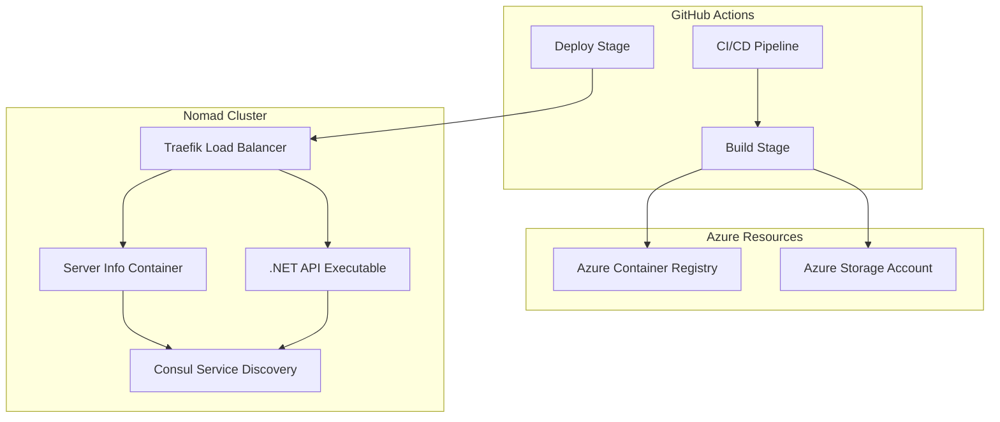

# Deployment Guide: Server Info & .NET API Applications

This guide provides comprehensive documentation for deploying the Server Info and .NET API applications to the Nomad cluster using GitHub Actions workflows.

## Overview

The Nomad cluster supports two types of application deployments:

1. **Server Info** - Containerized web application deployed using Docker
2. **.NET API** - Executable application deployed using the exec driver

Both applications use automated CI/CD pipelines with GitHub Actions and are integrated with Traefik for load balancing and routing.

## Architecture



## Server Info Application

### Application Type
- **Framework**: Python Flask web application
- **Deployment**: Docker container
- **Driver**: `docker`
- **Port**: 8080

### Nomad Job Configuration
**File**: `jobs/server-info.nomad`

Key variables:
- `IMAGE_VERSION`: Docker image version tag
- `ACR_NAME`: Azure Container Registry name
- `IMAGE_NAME`: Docker image name (default: `nomad-app`)

Service configuration:
- **Service name**: `server-info`
- **Health check**: HTTP GET to `/`
- **Traefik route**: `/server-info`

### Deployment Workflow
**File**: `.github/workflows/deploy-server-info.yml`

#### Triggers
- Manual workflow dispatch with environment selection (dev/stg/prd)
- Automatic deployment on pushes to main branch affecting relevant files

#### Build Stage
1. **Azure Authentication**: OIDC login with managed identity
2. **Environment Setup**: Dynamic resource group and ACR name calculation
3. **Docker Build**: Build and push container image to ACR
4. **Image Tagging**: Uses format `{GITHUB_RUN_ID}-{SHORT_SHA}`

#### Deploy Stage
1. **Nomad CLI Setup**: Install and configure Nomad client
2. **Load Balancer Discovery**: Auto-detect Nomad server IP
3. **Job Validation**: Validate Nomad job configuration
4. **Deployment**: Execute `nomad job run` with variables
5. **Verification**: Check deployment status and provide summary

#### Environment Variables
```bash
# Resource naming pattern
PREFIX="nomad-cluster"
RESOURCE_GROUP="rg-${PREFIX}-${ENV}"
ACR_NAME="nmdclstr${ENV}acr"
LB_NAME="nmdclstr-${ENV}-lb"
```

## .NET API Application

### Application Type
- **Framework**: .NET 8 Minimal API
- **Deployment**: Executable binary
- **Driver**: `exec`
- **Port**: Dynamic (assigned by Nomad)

### Features
- CRUD operations with in-memory storage
- Health check endpoint (`/health`)
- System information endpoint
- Swagger UI integration
- Environment-specific configuration

### Nomad Job Configuration
**File**: `jobs/dotnet-api.nomad`

Key variables:
- `API_VERSION`: Version identifier for the executable
- `ARTIFACT_SOURCE`: Source type (`local` or `remote`)
- `ARTIFACT_PATH`: Path or URL to artifact directory

Service configuration:
- **Service name**: `dotnet-api`
- **Health check**: HTTP GET to `/health`
- **Traefik route**: `/dotnet-api`

### Deployment Workflow
**File**: `.github/workflows/deploy-dotnet-api.yml`

#### Triggers
- Manual workflow dispatch with environment selection (dev/stg/prd)
- Automatic deployment on pushes to main branch affecting relevant files

#### Build Stage
1. **.NET Setup**: Configure .NET 8.0 SDK
2. **Application Build**: Compile and publish for Linux x64
3. **Artifact Creation**: Package executable and dependencies
4. **Azure Storage Upload**: Upload ZIP artifact to Azure Storage
5. **Version Tagging**: Uses format `{GITHUB_RUN_ID}-{SHORT_SHA}`

#### Deploy Stage
1. **Artifact URL Generation**: Create SAS token for secure access
2. **Nomad CLI Setup**: Install and configure Nomad client
3. **Load Balancer Discovery**: Auto-detect Nomad server IP
4. **Job Validation**: Validate Nomad job configuration
5. **Deployment**: Execute `nomad job run` with variables
6. **Verification**: Check deployment status and provide summary

#### Environment Variables
```bash
# Resource naming pattern
PREFIX="nomad-cluster"
RESOURCE_GROUP="rg-${PREFIX}-${ENV}"
STORAGE_ACCOUNT="nmdclstr${ENV}storage"
```

## Deployment Process

### Prerequisites
1. **Infrastructure**: Nomad cluster must be provisioned via Terraform
2. **Azure Resources**: ACR and Storage Account must exist
3. **Permissions**: GitHub Actions needs Azure RBAC permissions
4. **Networking**: Load Balancer must be accessible from GitHub runners

### Manual Deployment
1. Navigate to GitHub Actions tab in repository
2. Select the appropriate workflow:
   - `Build and Deploy Server Info app to Nomad`
   - `Build and Deploy .NET API to Nomad`
3. Click "Run workflow"
4. Select target environment (dev/stg/prd)
5. Monitor deployment progress

### Automatic Deployment
- Pushes to main branch trigger automatic deployments
- Only runs when relevant files are modified
- Uses default environment (dev)

### Deployment Commands

#### Server Info
```bash
# Manual deployment with custom variables
nomad job run \
  -var="IMAGE_VERSION=custom-tag" \
  -var="ACR_NAME=nmdclstrdevacr" \
  -var="IMAGE_NAME=server-info" \
  jobs/server-info.nomad

# Check deployment status
nomad job status server-info-web
```

#### .NET API
```bash
# Manual deployment with custom variables
nomad job run \
  -var="API_VERSION=custom-version" \
  -var="ARTIFACT_SOURCE=remote" \
  -var="ARTIFACT_PATH=https://nmdclstrdevstorage.blob.core.windows.net/artifacts" \
  jobs/dotnet-api.nomad

# Check deployment status
nomad job status dotnet-crud-api
```

## Accessing Applications

### URLs
After successful deployment, applications are accessible via the Load Balancer IP:

- **Server Info**: `http://<LB_IP>/server-info`
- **.NET API**: `http://<LB_IP>/dotnet-api`
- **.NET API Health**: `http://<LB_IP>/dotnet-api/health`
- **.NET API Swagger**: `http://<LB_IP>/dotnet-api/swagger`

### Nomad UI
- **URL**: `http://<LB_IP>:4646`
- **Job Monitoring**: Available in Nomad UI for detailed status

## Environment Configuration

### Development (dev)
- Resource Group: `rg-nomad-cluster-dev`
- ACR: `nmdclstrdevacr.azurecr.io`
- Storage: `nmdclstrdevstorage`

### Staging (stg)
- Resource Group: `rg-nomad-cluster-stg`
- ACR: `nmdclstrstgacr.azurecr.io`
- Storage: `nmdclstrstgstorage`

### Production (prd)
- Resource Group: `rg-nomad-cluster-prd`
- ACR: `nmdclstrprdacr.azurecr.io`
- Storage: `nmdclstrprdstorage`

## Monitoring and Troubleshooting

### Health Checks
Both applications include comprehensive health checks:
- **Server Info**: HTTP GET to `/` every 10 seconds
- **.NET API**: HTTP GET to `/health` every 10 seconds

### Service Discovery
Applications register with Consul for service discovery:
- Service names: `server-info` and `dotnet-api`
- Tags include Traefik configuration for routing

### Logging
- GitHub Actions provides detailed deployment logs
- Nomad UI shows real-time job status and allocation logs
- Application logs are available via Nomad allocation inspection

### Common Issues

#### Deployment Failures
1. **Authentication**: Check Azure credentials and permissions
2. **Networking**: Verify Load Balancer IP accessibility
3. **Resources**: Ensure ACR/Storage Account exist and are accessible
4. **Configuration**: Validate Nomad job syntax with `nomad job validate`

#### Runtime Issues
1. **Health Checks**: Verify application endpoints are responding
2. **Service Registration**: Check Consul service registration
3. **Traefik Routing**: Confirm Traefik configuration and rules
4. **Resource Limits**: Monitor CPU/memory allocation

## Security Considerations

### Azure Authentication
- Uses OIDC with managed identities (no stored secrets)
- Least privilege access to Azure resources
- Temporary SAS tokens for artifact access

### Network Security
- Private Azure Container Registry
- Private Storage Account with SAS tokens
- Load Balancer with proper network rules

### Application Security
- Environment-specific configuration
- No sensitive data in container images
- Secure artifact distribution

## Scaling and Updates

### Scaling
- Modify `count` parameter in Nomad job files
- Horizontal scaling handled by Nomad scheduler
- Load balancing automatically updated by Traefik

### Updates
- Deployments trigger automatic rolling updates
- Health checks ensure zero-downtime deployments
- Previous versions remain available for rollback

### Rollback
```bash
# Redeploy previous version
nomad job run -var="IMAGE_VERSION=previous-tag" jobs/server-info.nomad
nomad job run -var="API_VERSION=previous-version" jobs/dotnet-api.nomad
```

## Best Practices

1. **Version Control**: Always use semantic versioning for releases
2. **Environment Separation**: Maintain separate dev/stg/prd environments
3. **Monitoring**: Implement comprehensive health checks and monitoring
4. **Security**: Use managed identities and avoid hardcoded secrets
5. **Testing**: Validate deployments in non-production environments first
6. **Documentation**: Keep deployment documentation updated with changes

## Support and Maintenance

### Regular Tasks
- Monitor GitHub Actions workflow performance
- Review Azure resource utilization and costs
- Update Nomad client versions as needed
- Maintain application dependencies

### Emergency Procedures
1. **Service Outage**: Check Nomad job status and restart if needed
2. **Deployment Failure**: Review GitHub Actions logs and fix configuration
3. **Resource Exhaustion**: Scale up Azure resources or optimize applications
4. **Security Issues**: Rotate credentials and update access policies

For additional support, refer to the troubleshooting guide or contact the infrastructure team.
